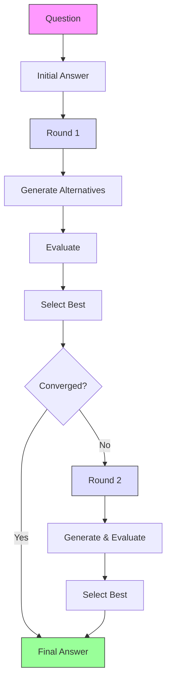

# ThinkThread SDK

[](https://opensource.org/licenses/MIT)

The ThinkThread SDK provides a powerful framework for improving LLM responses through the Chain-of-Recursive-Thoughts technique. By generating multiple alternative responses, evaluating them, and selecting the best option over multiple iterations, ThinkThread significantly enhances answer quality and reasoning capabilities.

## What is Chain-of-Recursive-Thoughts?

Chain-of-Recursive-Thoughts is a technique that improves the quality of answers from large language models through a recursive self-refinement process:

1. Generate an initial answer to a question
2. For each refinement round:
   - Generate alternative answers
   - Evaluate all answers (current and alternatives)
   - Select the best answer for the next round
3. Return the final selected answer

This process enables the model to critically examine its own responses, consider alternative perspectives, and ultimately produce higher-quality answers.



## Installation

### Using pip (once published)

```bash
pip install thinkthread
```

### Using Poetry

```bash
poetry add thinkthread
```

## Getting Started

### Installation

```bash
# Using pip (once published)
pip install thinkthread

# Using Poetry
poetry add thinkthread
```

### Quick Examples

#### CLI Usage

```bash
# Basic usage
thinkthread run "What are the implications of quantum computing on cryptography?"

# With specific provider and streaming
thinkthread run "Explain relativity" --provider anthropic --stream

# Advanced configuration
thinkthread run "Compare democracy and autocracy" --rounds 3 --alternatives 4
```

#### Python API

```python
from thinkthread_sdk.session import ThinkThreadSession
from thinkthread_sdk.llm import OpenAIClient

# Setup
client = OpenAIClient(api_key="your-api-key", model_name="gpt-4")
session = ThinkThreadSession(llm_client=client, alternatives=3, rounds=2)

# Run reasoning
question = "What are the challenges in sustainable energy adoption?"
answer = session.run(question)
print(f"Answer: {answer}")
```

## Configuration

Configure the SDK using environment variables, a `.env` file, or programmatically:

```python
# Environment variables or .env file
OPENAI_API_KEY=your-openai-api-key
ANTHROPIC_API_KEY=your-anthropic-api-key
HF_API_TOKEN=your-huggingface-token

# Default settings
PROVIDER=openai                # Default provider
ALTERNATIVES=3                 # Number of alternatives per round
ROUNDS=2                       # Number of refinement rounds
USE_PAIRWISE_EVALUATION=true   # Evaluation method
```

### Programmatic Configuration

```python
from thinkthread_sdk.config import create_config

config = create_config(
    provider="anthropic",
    alternatives=4,
    rounds=2,
    use_pairwise_evaluation=True
)
```

## Key Features

| Feature | Description |
|---------|-------------|
| **Multiple LLM Providers** | Support for OpenAI, Anthropic, and HuggingFace models |
| **Recursive Reasoning** | Multi-round refinement process for improved answers |
| **Evaluation Strategies** | Self-evaluation and pairwise comparison of answers |
| **Async & Streaming** | Non-blocking API and real-time token-by-token output |
| **Customizable Prompts** | Jinja2 templates for all prompting needs |
| **Performance Optimizations** | Parallel processing, caching, and early termination |
| **Extensible Architecture** | Easy to add new providers or evaluation strategies |

## Performance Optimizations

The SDK includes several performance enhancements that can be enabled through configuration:

| Optimization | Description | Speed Improvement |
|--------------|-------------|-------------------|
| **Parallel Processing** | Concurrent generation and evaluation | 1.4-2.0x |
| **Batched Requests** | Combine multiple prompts in one API call | 2.1-2.2x |
| **Semantic Caching** | Cache similar prompts using embeddings | 1.2-1.8x |
| **Early Termination** | Stop when answers converge | 1.3-4.3x |

### Configuration Example

```python
from thinkthread_sdk.config import ThinkThreadConfig
from thinkthread_sdk.session import ThinkThreadSession

# Enable optimizations
config = ThinkThreadConfig(
    parallel_alternatives=True,
    use_caching=True,
    early_termination=True,
    use_batched_requests=True
)

# Create optimized session
session = ThinkThreadSession(
    llm_client=client,
    alternatives=3,
    rounds=2,
    config=config
)
```

For detailed tuning options, see the [Performance Guide](docs/performance_optimization.md).

## Development

```bash
# Install dependencies
poetry install

# Run tests
poetry run pytest
```

For detailed documentation, see the docs directory.

## Contributing

Found a bug or have a feature request? Please open an issue on the [GitHub Issues](https://github.com/tomascupr/cort-sdk/issues) page.

## License

This project is licensed under the MIT License - see the [LICENSE](LICENSE) file for details.
