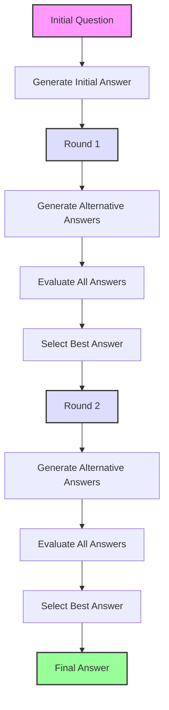

# ThinkThread SDK

The ThinkThread SDK provides a framework for improving LLM responses through a Chain-of-Recursive-Thoughts technique. ThinkThread enhances answer quality by generating alternative responses, evaluating them, and selecting the best option over multiple iterations.

## What is Chain-of-Recursive-Thoughts?

Chain-of-Recursive-Thoughts is a technique that improves the quality of answers from large language models through a recursive self-refinement process:

1. Generate an initial answer to a question
2. For each refinement round:
   - Generate alternative answers
   - Evaluate all answers (current and alternatives)
   - Select the best answer for the next round
3. Return the final selected answer

This process enables the model to critically examine its own responses, consider alternative perspectives, and ultimately produce higher-quality answers.



## Installation

### Using pip (once published)

```bash
pip install thinkthread
```

### Using Poetry

```bash
poetry add thinkthread
```

## Quickstart

### Using the CLI

```bash
# Run a query with default settings
thinkthread run "What are the implications of quantum computing on cryptography?"

# Run a query with a specific provider
thinkthread run "Explain the theory of relativity" --provider anthropic

# Run a query with more refinement rounds
thinkthread run "Compare and contrast democracy and autocracy" --rounds 3 --alternatives 5

# Stream the response as it's generated
thinkthread run "Describe the water cycle" --stream
```

### Using the Python API

```python
from thinkthread_sdk.session import ThinkThreadSession
from thinkthread_sdk.llm import OpenAIClient

# Initialize an LLM client
client = OpenAIClient(api_key="your-api-key", model_name="gpt-4")

# Create a ThinkThread session
session = ThinkThreadSession(llm_client=client, alternatives=3, rounds=2)

# Run recursive reasoning on a question
question = "What are the major challenges in sustainable energy adoption?"
answer = session.run(question)

print(f"Question: {question}")
print(f"Answer: {answer}")
```

## Configuration

The ThinkThread SDK can be configured using environment variables or a `.env` file:

```
# LLM Provider API Keys
OPENAI_API_KEY=your-openai-api-key
ANTHROPIC_API_KEY=your-anthropic-api-key
HF_API_TOKEN=your-huggingface-token

# Default Provider and Model
PROVIDER=openai
OPENAI_MODEL=gpt-4
ANTHROPIC_MODEL=claude-2

# ThinkThread Algorithm Parameters
ALTERNATIVES=3
ROUNDS=2
MAX_ROUNDS=3

# Evaluation Options
USE_PAIRWISE_EVALUATION=true
USE_SELF_EVALUATION=false

# Other Settings
PROMPT_DIR=/path/to/custom/prompts
```

## Features

The ThinkThread SDK provides these key capabilities:

- **Multiple LLM Providers**: Support for OpenAI, Anthropic, and HuggingFace models
- **Prompt Templating**: Customisable Jinja2 templates for all prompting needs
- **Recursive Reasoning**: Multi-round refinement process for improved answers
- **Self-Evaluation**: Ability to evaluate answer quality without external criteria
- **Pairwise Evaluation**: Compare answers head-to-head for better selection
- **Asynchronous Support**: Non-blocking API for integration with async applications
- **Streaming Responses**: Real-time token-by-token output for better user experience
- **Extensible Architecture**: Easily add new providers or evaluation strategies

## Development

```bash
# Install dependencies
poetry install

# Run tests
poetry run pytest
```

For detailed documentation, see the docs directory.

## Contributing

Found a bug or have a feature request? Please open an issue on the [GitHub Issues](https://github.com/tomascupr/cort-sdk/issues) page.

## License

This project is licensed under the MIT License - see the [LICENSE](LICENSE) file for details.
