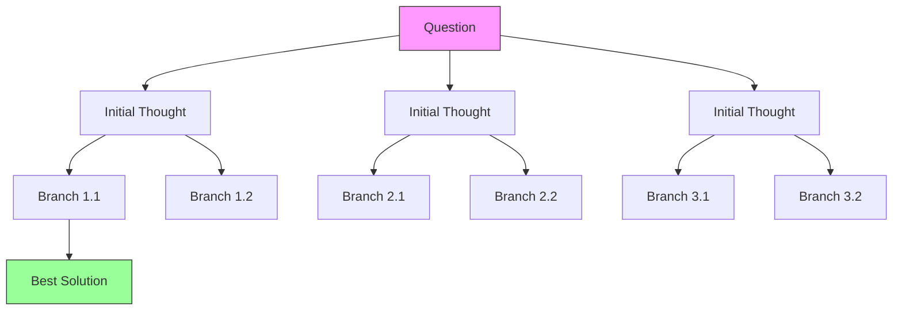

# ThinkThread SDK

[](https://pypi.org/project/thinkthread/)
[](https://pypi.org/project/thinkthread/)
[](https://opensource.org/licenses/MIT)
[](https://github.com/psf/black)

## Supercharge Your AI Applications with Human-Like Reasoning

**ThinkThread SDK** transforms ordinary AI responses into extraordinary insights by teaching language models to think more like humans do – considering alternatives, evaluating options, and refining their thoughts through both linear and tree-based reasoning approaches.

Imagine if your AI could:
- **Challenge its own first assumptions** instead of sticking with initial responses
- **Explore multiple reasoning paths in parallel** to tackle complex problems
- **Evaluate and prune less promising solutions** to focus on the best ideas
- **Self-critique and improve** through iterative reasoning
- **Deliver consistently higher-quality responses** that your users will love

That's exactly what ThinkThread delivers – in just a few lines of code.

## Why ThinkThread?

Traditional LLM applications suffer from common problems: hallucinations, shallow reasoning, and inconsistent quality. ThinkThread solves these challenges by implementing a unified reasoning framework with two complementary approaches:

1. **Chain-of-Recursive-Thoughts (CoRT)**: Linear refinement process that iteratively improves answers
2. **Tree-of-Thoughts (ToT)**: Tree-based search that explores multiple reasoning paths in parallel

| Without ThinkThread | With ThinkThread |
|---------------------|------------------|
| Single-pass responses | Multi-round refinement process |
| Linear reasoning only | Both linear and tree-based reasoning |
| No self-evaluation | Critical examination of answers |
| Limited perspective | Exploration of multiple reasoning paths |
| No pruning of weak ideas | Focus on most promising solutions |
| Inconsistent quality | Reliably improved responses |
| "Take it or leave it" answers | Progressively refined insights |
| One-size-fits-all approach | Choose the right reasoning strategy for each task |

The **unified reasoning framework** gives developers the flexibility to select the optimal approach for each use case:

- **Chain-of-Recursive-Thoughts**: Best for content creation, technical writing, summarization, and factual QA
- **Tree-of-Thoughts**: Best for strategic planning, creative ideation, multi-step reasoning, and research

Developers report **30-70% improvement in response quality** when using ThinkThread in production applications, with the ability to tackle more complex reasoning tasks than ever before.

## Potential Applications

ThinkThread is designed for next-generation AI applications across industries:

| Industry | Use Case | ThinkThread Advantage |
|----------|----------|----------------------|
| **Customer Support** | AI agents that solve complex customer issues | Potential to reduce escalations through better reasoning |
| **Content Creation** | Article and report generation | Produces more nuanced, balanced, and factually accurate content |
| **Education** | Personalized tutoring systems | Explains concepts from multiple angles until students understand |
| **Research** | Literature analysis and hypothesis generation | Considers contradictory evidence and alternative explanations |
| **Decision Support** | Strategic planning assistants | Evaluates multiple scenarios before making recommendations |

## How It Works: Advanced Reasoning Approaches

ThinkThread implements two powerful human-inspired thinking processes:

### Chain-of-Recursive-Thoughts


### Tree-of-Thoughts



The process works like this:

1. **Initial Thinking**: Generate a first answer to a question (just like standard LLMs)
2. **Exploration & Refinement**: For each thinking round:
   - Generate creative alternative answers (like brainstorming)
   - Evaluate all answers against each other (like critical thinking)
   - Select the best answer to build upon (like focused reasoning)
3. **Delivery**: Return the final polished answer

This mirrors how experts approach complex problems – starting with initial ideas, exploring alternatives, evaluating options, and progressively refining their thinking.

## Installation

### Using pip

```bash
pip install thinkthread
```

### Using Poetry

```bash
poetry add thinkthread
```

## Getting Started

### Installation

```bash
# Using pip (once published)
pip install thinkthread

# Using Poetry
poetry add thinkthread
```

### Quick Examples

#### CLI Usage

```bash
# Basic usage with Chain-of-Recursive-Thoughts
thinkthread run "What are the implications of quantum computing on cryptography?"

# With specific provider and streaming
thinkthread run "Explain relativity" --provider anthropic --stream

# Advanced configuration
thinkthread run "Compare democracy and autocracy" --rounds 3 --alternatives 4

# Unified CLI with explicit reasoning approach selection
thinkthread think "What are the implications of quantum computing on cryptography?" --approach cort

# Using Tree-of-Thoughts reasoning with the unified CLI
thinkthread think "Design a system for autonomous vehicles" --approach tot --beam-width 5
```

#### Python API

```python
from thinkthread_sdk.session import ThinkThreadSession
from thinkthread_sdk.llm import OpenAIClient

# Setup
client = OpenAIClient(api_key="your-api-key", model_name="gpt-4")
session = ThinkThreadSession(llm_client=client, alternatives=3, rounds=2)

# Run reasoning
question = "What are the challenges in sustainable energy adoption?"
answer = session.run(question)
print(f"Answer: {answer}")
```

### Higher-level Abstractions

For common reasoning patterns, ThinkThread SDK provides simplified one-liner methods:

- **Self-refinement**: Ideal for improving an existing answer through iterative critique and revision. Perfect for content editing, fact-checking, and enhancing the quality of drafted responses.
- **N-best brainstorming**: Excellent for generating multiple diverse solutions and selecting the best one. Great for creative tasks, problem-solving, and exploring different approaches to a question.

```python
from thinkthread_sdk.utils import ThinkThreadUtils
from thinkthread_sdk.llm import OpenAIClient

# Setup
client = OpenAIClient(api_key="your-api-key", model_name="gpt-4")
utils = ThinkThreadUtils(llm_client=client)

# Self-refinement: Refine an existing answer
question = "What are the challenges in sustainable energy adoption?"
initial_answer = "Cost and infrastructure are challenges."
refined_answer = utils.self_refine(question, initial_answer, rounds=2)
print(f"Refined answer: {refined_answer}")

# Get detailed metadata about the reasoning process
result = utils.self_refine(question, initial_answer, return_metadata=True)
print(f"Final answer: {result['final_answer']}")
print(f"Improvement after {result['rounds']} rounds with {result['alternatives_per_round']} alternatives per round")

# N-best brainstorming: Generate multiple answers and select the best
question = "What are creative solutions to reduce plastic waste?"
best_answer = utils.n_best_brainstorm(question, n=5)
print(f"Best answer: {best_answer}")

# Get metadata about the brainstorming process
result = utils.n_best_brainstorm(question, n=5, return_metadata=True)
print(f"Best answer (score: {result['best_score']:.2f}): {result['best_answer']}")
print(f"Generated {len(result['all_node_ids'])} candidate solutions")

# Async APIs are also available
import asyncio

refined_answer = await utils.self_refine_async(question, initial_answer, rounds=2)
best_answer = await utils.n_best_brainstorm_async(question, n=5)
```

These utilities can also be accessed through the CLI:

```bash
# Self-refinement
thinkthread refine "What are the challenges in sustainable energy adoption?" "Cost and infrastructure are challenges."

# N-best brainstorming
thinkthread brainstorm "What are creative solutions to reduce plastic waste?" --candidates 5
```

## Configuration

Configure the SDK using environment variables, a `.env` file, or programmatically:

```python
# Environment variables or .env file
OPENAI_API_KEY=your-openai-api-key
ANTHROPIC_API_KEY=your-anthropic-api-key
HF_API_TOKEN=your-huggingface-token

# Default settings
PROVIDER=openai                # Default provider
ALTERNATIVES=3                 # Number of alternatives per round
ROUNDS=2                       # Number of refinement rounds
USE_PAIRWISE_EVALUATION=true   # Evaluation method
```

### Programmatic Configuration

```python
from thinkthread_sdk.config import create_config

config = create_config(
    provider="anthropic",
    alternatives=4,
    rounds=2,
    use_pairwise_evaluation=True
)
```

## Key Features

| Feature | Description |
|---------|-------------|
| **Multiple LLM Providers** | Support for OpenAI, Anthropic, and HuggingFace models |
| **Recursive Reasoning** | Multi-round refinement process for improved answers |
| **Tree-of-Thoughts** | Explore multiple reasoning paths in parallel for complex problems |
| **Evaluation Strategies** | Self-evaluation and pairwise comparison of answers |
| **Async & Streaming** | Non-blocking API and real-time token-by-token output |
| **Customizable Prompts** | Jinja2 templates for all prompting needs |
| **Performance Optimizations** | Parallel processing, caching, and early termination |
| **Extensible Architecture** | Easy to add new providers or evaluation strategies |

## Performance Optimizations

The SDK includes several performance enhancements that can be enabled through configuration:

| Optimization | Description | Speed Improvement |
|--------------|-------------|-------------------|
| **Parallel Processing** | Concurrent generation and evaluation | 1.4-2.0x |
| **Batched Requests** | Combine multiple prompts in one API call | 2.1-2.2x |
| **Semantic Caching** | Cache similar prompts using embeddings | 1.2-1.8x |
| **Early Termination** | Stop when answers converge | 1.3-4.3x |

### Configuration Example

```python
from thinkthread_sdk.config import ThinkThreadConfig
from thinkthread_sdk.session import ThinkThreadSession

# Enable optimizations
config = ThinkThreadConfig(
    parallel_alternatives=True,
    use_caching=True,
    early_termination=True,
    use_batched_requests=True
)

# Create optimized session
session = ThinkThreadSession(
    llm_client=client,
    alternatives=3,
    rounds=2,
    config=config
)
```

For detailed tuning options, see the [Performance Guide](docs/performance_optimization.md).

## Tree-of-Thoughts Reasoning

ThinkThread SDK now includes a powerful Tree-of-Thoughts (ToT) solver that explores multiple reasoning paths in parallel:

```python
from thinkthread_sdk.tree_thinker import TreeThinker
from thinkthread_sdk.llm import OpenAIClient
from thinkthread_sdk.config import create_config

# Setup
client = OpenAIClient(api_key="your-api-key", model_name="gpt-4")
tree_thinker = TreeThinker(
    llm_client=client,
    max_tree_depth=3,         # Maximum depth of the thinking tree
    branching_factor=3,       # Number of branches per node
)

# Solve a problem using tree-based search
problem = "What are three key benefits of tree-based search for reasoning?"
result = tree_thinker.solve(
    problem=problem,
    beam_width=2,             # Number of parallel thought threads
    max_iterations=2          # Number of expansion iterations
)

# Find the best solution
best_node_id = max(
    tree_thinker.threads.keys(),
    key=lambda node_id: tree_thinker.threads[node_id].score
)
best_node = tree_thinker.threads[best_node_id]

print(f"Best solution (score: {best_node.score:.2f}):")
print(best_node.state.get("current_answer", "No answer found"))
```

### Asynchronous API

For non-blocking operation, use the asynchronous API:

```python
import asyncio

# Solve asynchronously
result = await tree_thinker.solve_async(
    problem="How can we address climate change through technology?",
    beam_width=3,
    max_iterations=2
)
```

### Command Line Interface

The TreeThinker module can be used from the command line in two ways:

```bash
# Using the dedicated ToT command
thinkthread tot "What are the benefits of tree-based search for reasoning?"

# With specific provider
thinkthread tot "Design a system for autonomous vehicles" --provider anthropic

# Advanced configuration
thinkthread tot "What are the ethical implications of AI?" --beam-width 5 --max-depth 4

# Using the unified CLI interface
thinkthread think "What are the benefits of tree-based search for reasoning?" --approach tot

# Unified CLI with advanced configuration
thinkthread think "What are the ethical implications of AI?" --approach tot --beam-width 5 --max-depth 4
```

For detailed documentation on Tree-of-Thoughts reasoning, see the [Tree-of-Thoughts Guide](docs/tree_thinker.md).

## Development

```bash
# Install dependencies
poetry install

# Run tests
poetry run pytest
```

For detailed documentation, see the docs directory.

## Contributing

Found a bug or have a feature request? Please open an issue on the [GitHub Issues](https://github.com/tomascupr/cort-sdk/issues) page.

## License

This project is licensed under the MIT License - see the [LICENSE](LICENSE) file for details.
