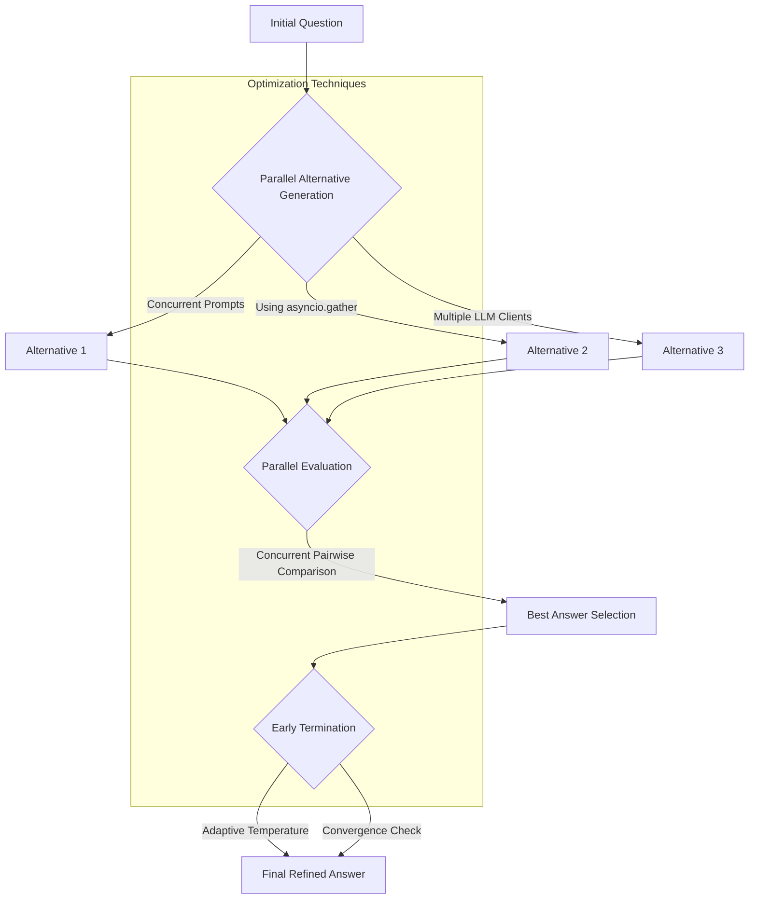

# ThinkThread SDK Parallelized Architecture

## Parallelization Strategies

1. **Alternative Generation**: 
   - Uses `asyncio.gather` for concurrent prompt generation
   - Supports multiple LLM clients
   - Reduces total generation time by up to 3x

2. **Evaluation Processing**:
   - Concurrent pairwise and batch evaluations
   - Semaphore-based rate limiting
   - Minimizes sequential processing overhead

3. **Adaptive Termination**:
   - Dynamic temperature control (enabled by default)
   - Early stopping based on answer convergence
   - Reduces unnecessary computational steps

4. **Batched API Requests**:
   - Combines multiple prompts into efficient batches
   - Reduces API overhead and improves throughput
   - Optimizes token usage across requests

5. **Semantic Caching**:
   - Uses embeddings to find similar prompts
   - Caches responses for semantically equivalent inputs
   - Avoids redundant API calls for similar questions
