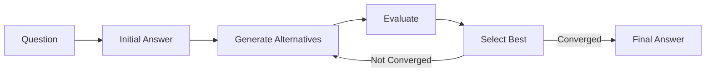
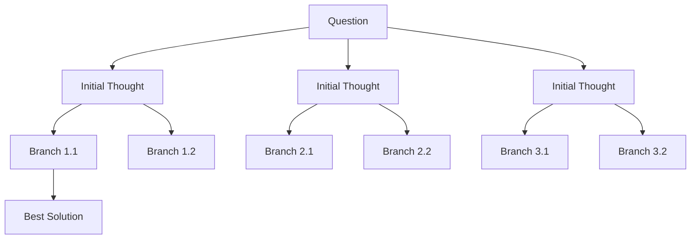

# Comparing Reasoning Approaches

This guide compares the two reasoning approaches available in the ThinkThread SDK: Chain-of-Recursive-Thoughts (CoRT) and Tree-of-Thoughts (ToT). Understanding the strengths and ideal use cases for each approach will help you choose the most appropriate technique for your specific application.

## Overview of Approaches

### Chain-of-Recursive-Thoughts (CoRT)

CoRT implements a linear refinement process that iteratively improves a single answer through multiple rounds:



**Process**:
1. Generate an initial answer to the question
2. Create multiple alternative answers (divergent thinking)
3. Evaluate all answers against each other (critical thinking)
4. Select the best answer to build upon (convergent thinking)
5. Repeat until quality converges or maximum rounds reached

### Tree-of-Thoughts (ToT)

ToT implements a tree-based search approach that explores multiple reasoning paths in parallel:



**Process**:
1. Generate multiple initial thoughts (diverse starting points)
2. Expand each thought into multiple branches (parallel exploration)
3. Evaluate all branches and prune less promising paths (beam search)
4. Continue expanding the most promising branches
5. Select the highest-scoring solution path

## Key Differences

| Feature | Chain-of-Recursive-Thoughts | Tree-of-Thoughts |
|---------|------------------------------|------------------|
| **Structure** | Linear refinement | Tree-based search |
| **State Management** | Single "best answer" | Multiple parallel paths |
| **Exploration Strategy** | Depth-focused | Breadth and depth balanced |
| **Token Usage** | More efficient | Can use more tokens |
| **Implementation Complexity** | Simpler | More complex |
| **Handling Dead Ends** | May get stuck in local optima | Can explore alternative paths |
| **Convergence** | Faster for well-defined problems | Better for complex, open-ended problems |

## When to Use Each Approach

### Choose Chain-of-Recursive-Thoughts (CoRT) When:

- **Questions have clear evaluation criteria**
- **Problems require deep refinement of a single line of reasoning**
- **Quality is more important than exploration breadth**
- **Applications have token budget constraints**

**Example use cases**:
- Content creation and refinement
- Technical writing and documentation
- Summarization tasks
- Factual question answering

**Key advantages**:
- More token-efficient than tree-based approaches
- Produces highly polished final outputs
- Easier to explain the reasoning process to end users
- Faster execution with fewer API calls

### Choose Tree-of-Thoughts (ToT) When:

- **Complex problems have multiple valid approaches**
- **Situations require creative exploration of alternatives**
- **Initial approach might lead to dead ends**
- **Applications where breadth of perspective is critical**

**Example use cases**:
- Strategic planning and decision support
- Creative ideation and brainstorming
- Multi-step reasoning problems
- Research and hypothesis generation

**Key advantages**:
- Explores multiple reasoning paths simultaneously
- Less likely to get stuck in local optima
- Can discover unexpected solutions
- Better handles problems with uncertain evaluation criteria

## Performance Considerations

### CoRT Performance Profile

- **Token Usage**: Moderate (depends on rounds and alternatives)
- **Response Time**: Faster for simple problems
- **Quality Improvement**: Consistent, incremental improvements
- **Scaling**: Linear with number of rounds

### ToT Performance Profile

- **Token Usage**: Higher (depends on beam width and tree depth)
- **Response Time**: Can be longer due to parallel exploration
- **Quality Improvement**: May find higher quality solutions for complex problems
- **Scaling**: Exponential with tree depth (mitigated by beam pruning)

## Hybrid Approaches

In some cases, you might want to combine both approaches:

1. **Sequential Hybrid**: Use ToT for initial exploration, then refine the best path with CoRT
2. **Parallel Hybrid**: Run both approaches and select the better result
3. **Adaptive Hybrid**: Start with CoRT and switch to ToT if progress stalls

## Code Examples

### Chain-of-Recursive-Thoughts Example

```python
from thinkthread_sdk.session import ThinkThreadSession
from thinkthread_sdk.llm import OpenAIClient

# Initialize client
client = OpenAIClient(api_key="your-api-key", model_name="gpt-4")

# Create session with CoRT approach
session = ThinkThreadSession(
    llm_client=client,
    alternatives=3,  # Generate 3 alternatives per round
    rounds=2,        # Perform 2 refinement rounds
)

# Run recursive reasoning
question = "What are the implications of quantum computing on cryptography?"
answer = session.run(question)

print(f"Question: {question}")
print(f"Answer: {answer}")
```

### Tree-of-Thoughts Example

```python
from thinkthread_sdk.tree_thinker import TreeThinker
from thinkthread_sdk.llm import OpenAIClient

# Initialize client
client = OpenAIClient(api_key="your-api-key", model_name="gpt-4")

# Create TreeThinker
tree_thinker = TreeThinker(
    llm_client=client,
    max_tree_depth=3,     # Maximum depth of the thinking tree
    branching_factor=3,   # Number of branches per node
)

# Solve a problem using tree-based search
problem = "Design a system for autonomous vehicles"
result = tree_thinker.solve(
    problem=problem,
    beam_width=3,         # Number of parallel thought threads
    max_iterations=2      # Number of expansion iterations
)

# Find the best solution
best_node_id = max(
    tree_thinker.threads.keys(),
    key=lambda node_id: tree_thinker.threads[node_id].score
)
best_node = tree_thinker.threads[best_node_id]

print(f"Best solution (score: {best_node.score:.2f}):")
print(best_node.state.get("current_answer", "No answer found"))
```

### Unified Interface Example

```python
from thinkthread_sdk.unified_cli import UnifiedReasoner
from thinkthread_sdk.llm import OpenAIClient

# Initialize client
client = OpenAIClient(api_key="your-api-key", model_name="gpt-4")

# Create a reasoner with automatic approach selection
reasoner = UnifiedReasoner(
    llm_client=client,
    approach="auto",  # Automatically select based on question complexity
)

# For a factual question (will likely use CoRT)
factual_question = "What are the implications of quantum computing on cryptography?"
factual_answer = reasoner.run(factual_question)

# For a creative question (will likely use ToT)
creative_question = "Design a system for autonomous vehicles"
creative_answer = reasoner.run(creative_question)
```

## Conclusion

Both CoRT and ToT offer powerful reasoning capabilities, but they excel in different scenarios. By understanding their strengths and weaknesses, you can choose the most appropriate approach for your specific use case or even combine them for optimal results.

For most general-purpose applications, start with CoRT due to its simplicity and efficiency. For complex problems requiring creative exploration or when facing potential reasoning dead ends, consider using ToT.
